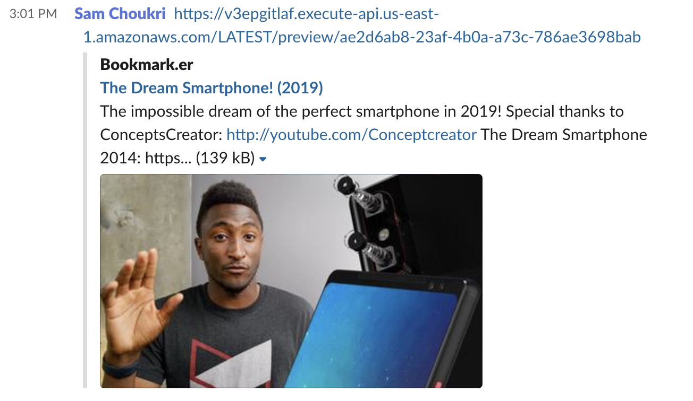

# LambdaSharp Bookmarker

## About this challenge
The challenge is to build a Bookmarking API that allows one to save, retreive, share, and preview links.

### Infrastructure:
* [AWS DynamoDB](https://aws.amazon.com/dynamodb/) database for Bookmark data.
* [AWS API Gateway](https://aws.amazon.com/api-gateway/) implements Bookmark REST API
* [AWS Lambda](https://aws.amazon.com/lambda/) runs business logic invoked by API Gateway and DynamoDB Streams.
* [MindTouch LambdaSharp Tool](https://lambdasharp.net/articles/ReleaseNotes-Favorinus.html) build and deploy clouldformation stack and assets to AWS.


#### Bookmark Schema
```json
{
    "ID": "32a7cf5a-35be-459a-b586-ec2bed2f4fef",
    "Url": "https://www.youtube.com/watch?v=M5NVwuyk2uM",
    "Title": "The Dream Smartphone! (2019)",
    "Description": "The impossible dream of the perfect smartphone in ...",
    "ImageUrl": "https://i.ytimg.com/vi/M5NVwuyk2uM/maxresdefault.jpg"
}
```

## Setup - .NET Core and AWS

* [Install .Net 2.1](https://dotnet.microsoft.com/download/dotnet-core/2.1)
* [Sign up for AWS account](https://aws.amazon.com/)
* [Install AWS CLI](https://aws.amazon.com/cli/)


## Setup - LambdaSharp Tool (aka `lash`)

For this challenge, we will be using a pre-release version of the LambdaSharp Tool
that is easier to configure and use.

### Upgrade `lash`

If you already have the LambdaSharp Tool installed, unfortunately you cannot  simply upgrade it to a pre-release version. First, you have to uninstall the previous version, then install the new version.

    ```
    dotnet tool uninstall -g LambdaSharp.Tool
    dotnet tool install -g LambdaSharp.Tool --version 0.7-RC3
    ```

### Install `lash`

    ```
    dotnet tool install -g LambdaSharp.Tool --version 0.7-RC3
    ```


### Clone Bookmarker repository

```
git clone git@github.com:LambdaSharp/Bookmarker.git
```

### Build and Deploy

```
cd Bookmarker
lash init --quick-start     // one time
lash deploy                 // to propagate code changes
```


## Level 1 -- Support Short URLs

Currently, bookmarks are created with a 37-character id (a `guid`) like `10cffe9e-ace5-444c-836b-635e6ec207d3`. Modify the `POST AddBookmark` API endpoint to instead use a short ID that is still unique. This will allow a future version of our Bookmark service to generate short urls like `https://bookmark.er/xYq`.

Ideally, you would NOT use a simple sequential integer as that would allow our competitors to know how many bookmarks are in our system.

## Level 2 -- Save OpenGraph Data

When a new bookmark is added to DynamoDB, it will only store the ID and Url. However, we want to record more information about our Bookmark in order to support a preview feature (Level 3). On an insert into our DynamoDB table, the lambda function `DynamoFunction` will be triggered.

Modify that function to retrieve the [OpenGraph](https://github.com/ghorsey/OpenGraph-Net)  data from the URL and update the Bookmark in DynamoDB to include the following fields: Title, Description, and ImageUrl.

[Retrieving OpenGraph Data from a URL](https://github.com/ghorsey/OpenGraph-Net#parsing-from-a-url)

## Level 3 -- Generate HTML Preview

Modify the API Gateway lambda function `GetBookmarkPreview` to return an HTML preview of a Bookmark. The HTML should include OpenGraph MetaData tags so that the preview renders correctly when the preview URL is shared in apps such as Slack, iMessage, etc.

[Writing out OpenGraph Example](https://github.com/ghorsey/OpenGraph-Net#writing-out-opengraph-metadata-to-the-head-tag)




## Level 4 -- Add Redirector

Modfy `Module.yml` file to add a new API endpoint called `GET:/redirect/{id}` which invokes a method that performs an HTTP redirect to the original Bookmark url.

## Boss Level -- Add Categories

Extend the Bookmark data model to include a list of categories that are relevant to the Bookmark. Your job is to figure out how to get the list of categories.
